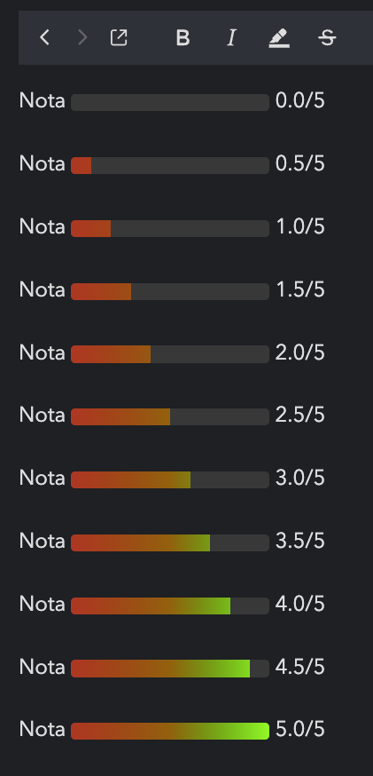

# Joplin Plugin Barra Progresso

Converte texto de avaliacao em barra visual de progresso, direto no corpo da nota.

Entrada:

nota 4.5

Saida (modo html, padrao): o rotulo e mantido, o primeiro numero e ocultado, e entre o rotulo e a fracao final aparece uma barra colorida com gradiente, por exemplo uma faixa vermelho-laranja-verde sobre trilho escuro, seguida de 4.5/5.

## Como funciona

O plugin roda em cada dispositivo de forma independente. A cada 2 segundos ele le as notas pela API de dados (joplin.data) e reescreve o texto quando detecta o padrao de nota. Nao depende de eventos de workspace, entao funciona em versoes do Joplin que nao expoe esses eventos, inclusive no mobile.

A palavra nota funciona em qualquer caixa: nota, NOTA, Nota, nOtA. Aceita separador espaco ou dois-pontos: nota 4.5 ou Nota: 4.5. O numero exibido e o que fica depois da barra; o primeiro e ocultado de proposito.

A barra usa mascara: o gradiente e desenhado na largura total fixa e so a fracao correspondente a nota e revelada. Assim a cor do inicio fica sempre na esquerda e a do fim sempre na direita, sem esticar nem comprimir conforme a nota, como se ve na imagem de exemplo.

A transformacao e idempotente: nota ja processada nao e reescrita de novo. Reescritas novas tem teto de 10 por ciclo, protegendo o sync de rajadas de escrita.

A listagem de notas e paginada seguindo o has_more da API, ate 100 itens por pagina, entao bibliotecas com mais de 100 notas sao varridas por completo.

## Parametros

No inicio de src/index.ts:

- MODO: html (barra colorida com gradiente e mascara, padrao) ou texto (blocos de caractere, sem cor).
- ESCALA: nota maxima, padrao 5.
- COMPRIMENTO_PX: largura total da barra em pixels, padrao 140.
- ALTURA: altura da barra em pixels, padrao 12.
- RAIO_BORDA: arredondamento em pixels, padrao 3.
- COMPRIMENTO_CHARS: tamanho da barra em blocos, usada so no modo texto, padrao 10.
- MOSTRAR_COLCHETES: liga ou desliga os colchetes ao redor da barra, padrao false.
- USAR_GRADIENTE: true usa linear-gradient; false usa cor solida mascarada, padrao true.
- COR_INICIO, COR_MEIO, COR_FIM: pontos do gradiente. COR_MEIO e opcional; deixe vazio para usar so inicio e fim. Padrao cb1e1e, a25e00, 00ff0d.
- COR_VAZIA: cor do trilho de fundo (parte nao preenchida), padrao 383838.
- CARACTER_CHEIO, CARACTER_MEIO, CARACTER_VAZIO: simbolos do modo texto, padrao blocos Unicode.
- INTERVALO_MS: frequencia do polling em milissegundos, padrao 2000.
- PROTECAO_EDICAO_MS: ignora notas editadas ha menos que esse tempo, para nao brigar com voce enquanto digita, padrao 1500.
- MAX_REESCRITAS_POR_CICLO: teto de reescritas por ciclo, padrao 10; use 1 para reproduzir o comportamento antigo de uma nota por ciclo.

## Build

npm install
npm run dist

O pacote fica em publish/com.lucas.barraprogresso.jpl, com o com.lucas.barraprogresso.json ao lado.

## Instalacao no desktop

Settings > Plugins > engrenagem > Install from file > selecione o .jpl em publish > reinicie.

## Instalacao no mobile

No iPhone o plugin vem do catalogo, que e alimentado pela publicacao no npm. Depois de publicado: Settings > Plugins > habilitar suporte de plugins > reiniciar o app > buscar por barra-progresso > instalar. Com o plugin instalado, o iPhone gera a barra localmente, offline, sem depender do desktop.

## Edicao

Edite sempre no modo Markdown. O modo rich text do editor nao entende o HTML da barra e apaga o span ao salvar, deixando a barra vazia. Em edicao o codigo da barra aparece cru (isso e o editor Markdown mostrando a fonte, vale no desktop e no mobile). Em visualizacao a barra aparece colorida, como na imagem de exemplo. Para mudar a nota, altere apenas o numero depois da barra e salve; o plugin refaz a barra.

## Limitacoes

- O modo html depende do renderizador aceitar style inline com linear-gradient. No Joplin mobile em visualizacao isso foi verificado funcionando, mas em edicao aparece cru, por comportamento do editor Markdown.
- O modo texto usa blocos Unicode que podem nao ter glifo em algumas fontes mobile; por isso o modo html e o padrao.
- O log interno grava em /tmp no desktop; no mobile cai em console, sem efeito pratico.

## Licenca

MIT
